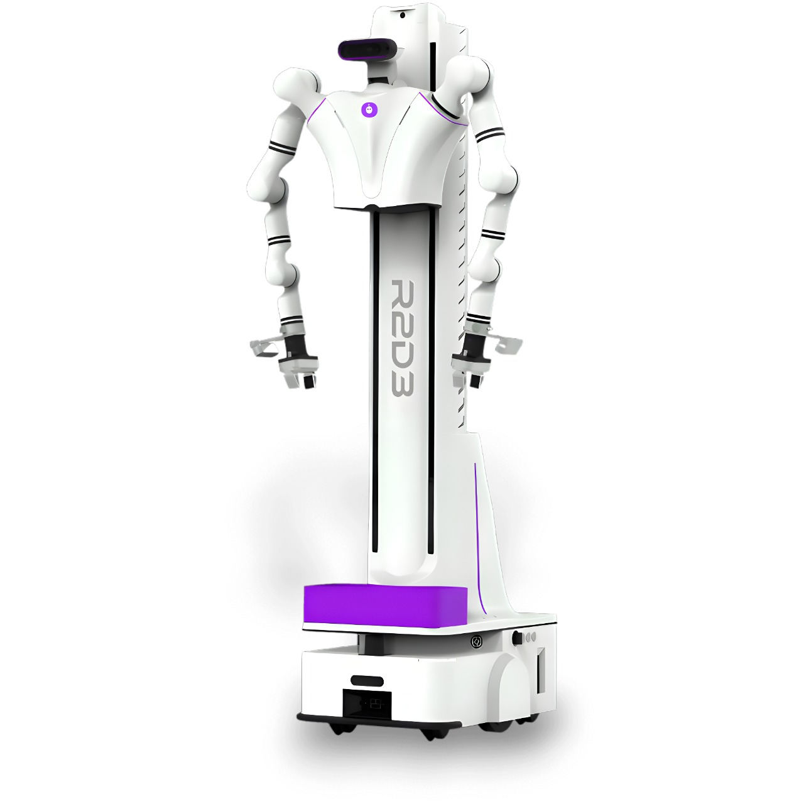

<div align="left">

# R2D3 — Isaac Sim platform



</div>

An [NVIDIA Isaac Sim 6.0](https://developer.nvidia.com/isaac/sim) port of Open Droids'
**R2D3** dual-arm composite-lifting mobile manipulator, packaged as an in-process
**Python platform** you can drive for reinforcement learning, vision/VLM policies,
teleoperation, or scripted control — no ROS required.

> This is the **`isaac-sim-v1`** branch. The original Gazebo/ROS 2 stack lives on
> `main`; the real-robot ROS 2 packages bundled here are documented in
> [`docs/ros2_packages.md`](docs/ros2_packages.md).

```python
from isaac_sim.r2d3_sim import R2D3

with R2D3(end_effector="dexterous") as sim:     # boots Isaac + loads the robot
    sim.reset()
    sim.set_arm_pose("left", [0.45, -0.21, 0.55], sim.top_down_quat)   # IK
    sim.set_gripper("left", 1.0)                # close
    rgb = sim.get_image("head")                 # numpy HxWx3, in-process
    wrench = sim.get_wrench("left")             # wrist force/torque
```

## Quick start

You need an NVIDIA GPU (driver ≥ 535) and [Miniforge](https://github.com/conda-forge/miniforge)
(or conda/mamba). One command creates the env, installs Isaac Sim 6.0 + the SDK,
ships the robot assets, and runs the smoke test:

```bash
git clone https://github.com/Open-Droids-robot/R2D3_ros2.git r2d3_isaac
cd r2d3_isaac && git checkout isaac-sim-v1
bash scripts/bootstrap.sh
```

Then run any example (everything launches through the wrapper, which sets the
env + library paths):

```bash
scripts/isaacsim_ros2.sh isaac_sim/examples/01_hello_robot.py
scripts/isaacsim_ros2.sh isaac_sim/examples/07_grasp_cube.py --ee gripper
```

Full setup notes (incl. the optional ROS bridge env): [`docs/setup.md`](docs/setup.md).

## Switching the arm / end-effector

The robot ships with two interchangeable end-effectors — a 5-finger **Inspire
dexterous hand** and a 2-finger **parallel gripper**. It's one argument; the IK,
grasp geometry, and finger control all adapt:

```python
R2D3(end_effector="dexterous")   # 5-finger hand
R2D3(end_effector="gripper")     # 2-finger gripper
```

Every example takes `--ee dexterous|gripper`. Both grasp-and-lift the cube
(`07_grasp_cube.py`). Use `R2D3(mobile=True)` to free the wheeled base for driving.

## What it does (V1)

- Dual **7-DOF arms** + switchable dexterous hand / parallel gripper
- Body **lift**, **head** pan/tilt
- **Cameras**: head + two wrist D435s — RGB + depth as numpy in-process (or over ROS)
- **Wrist force-torque** sensing
- **Lula IK** (left arm) + IK grasp-and-lift
- **Mobile base** (kinematic drive + rolling wheels)
- Ready-made **RL** (`gymnasium` env), **VLM** (perception loop), and **teleop** interfaces
- Optional **ROS 2 bridge** to the real-robot message surface

## Repo layout

| Path | What |
|---|---|
| `isaac_sim/r2d3_sim/` | the platform SDK — `R2D3` facade, control/sensing, cameras, IK, `envs/` |
| `isaac_sim/examples/` | runnable demos (`01`–`07`) |
| `isaac_sim/tests/` | smoke + motion verification; `diagnostics/` = archived probes |
| `isaac_sim/urdf/`, `usd_*/` | robot description + built USD assets |
| `scripts/` | `bootstrap.sh`, the `isaacsim_ros2.sh` launcher, asset builders |
| `docs/` | setup, run, API, platform, examples, bridge, architecture |
| `r2d3_humble_bridge/`, `r2d3_model*/`, `ros2_*/` | the ROS 2 / real-robot stack (see [`docs/ros2_packages.md`](docs/ros2_packages.md)) |

## Documentation

- **[Setup](docs/setup.md)** · **[Run](docs/run.md)** — install + launch
- **[API reference](docs/api.md)** — the `R2D3` SDK
- **[Platform guide](docs/platform.md)** — RL / VLM / teleop patterns
- **[Examples](docs/examples.md)** · **[Architecture](docs/architecture.md)** · **[ROS bridge](docs/bridge.md)**
- **[AGENTS.md](AGENTS.md)** — full working guide for AI coding agents

## License

See [`LICENSE`](LICENSE). R2D3 hardware + the upstream ROS 2 packages are by
[Open Droids](https://github.com/Open-Droids-robot).
