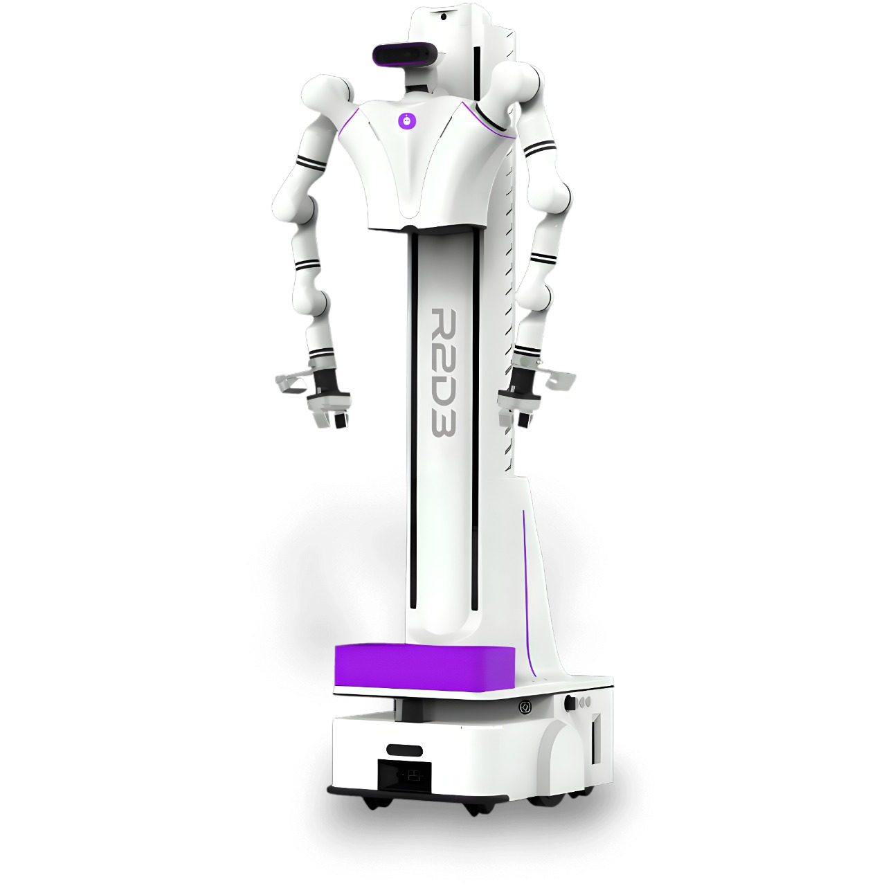

# Open Droids - R2D3



ROS 2 **Jazzy** workspace for the **Open Droids R2D3**, a dual-arm mobile
manipulator:

- **Base:** differential-drive chassis with a 2D lidar and an IMU.
- **Torso:** a lifting column that raises and lowers both arms.
- **Arms:** two RealMan arms, either **RM65-B** (6-DOF) or **RM75-B** (7-DOF),
  each with a RealSense D435 camera on the wrist.
- **Head:** a pan/tilt neck carrying a ZED 2 stereo camera.

The whole robot also runs in **simulation**, on **Gazebo Harmonic** or
**MuJoCo**, so you can develop navigation, manipulation and agent behaviour
without the hardware. The simulated robot uses the **same URDF, topics,
frames and controllers** as the real one, so code written against the sim
runs on the robot unchanged.

## Contents

- [Quick start: simulation in a container](#-quick-start-simulation-in-a-container)
- [Running the simulation natively](#-running-the-simulation-natively)
- [Choosing a simulator](#-choosing-a-simulator)
- [Launch levels](#-launch-levels)
- [Working with the simulated robot](#-working-with-the-simulated-robot)
- [Rogent agent mode](#-rogent-agent-mode)
- [Repository layout](#-repository-layout)
- [Real robot](#-real-robot)
- [Troubleshooting](#troubleshooting)

---

## 🚀 Quick start: simulation in a container

This is the fastest way to see the robot. All you need is **bash and Docker**.
You don't need ROS 2, GPU drivers or an X11 setup on the host.

```bash
git clone https://github.com/Open-Droids-robot/R2D3_ros2.git
cd R2D3_ros2
./droid up            # Gazebo Harmonic (default)
./droid up --mujoco   # or MuJoCo
```

`./droid up` does five things:

1. **Probes your platform.** It checks whether Docker can actually reach an
   NVIDIA GPU, not just whether one is installed.
2. **Pulls or builds the image.** This is a single ROS 2 Jazzy image with
   Gazebo, MuJoCo, Nav2 and MoveIt preinstalled.
3. **Starts one container** with your checkout bind-mounted at
   `/ws/src/R2D3_ros2`.
4. **Rebuilds the simulation packages** so that your latest edits are always
   included.
5. **Launches the simulator and RViz** and prints the URL of the desktop.

Open the desktop in any browser:

**<http://localhost:6080/vnc.html?autoconnect=1&resize=scale>**

It is split into four panes:

```
+-------------------------+-------------------------+
| simulator               | RViz                    |
| (Gazebo / MuJoCo)       |                         |
+-------------------------+-------------------------+
| rogent agent (goal>)    | shell                   |
| rogent mode only        | ROS + workspace sourced |
+-------------------------+-------------------------+
```

The **shell** pane already has ROS and the workspace sourced, so
`ros2 topic list` works straight away. Click a pane to give it keyboard focus.
The same command and URL work on an amd64 Linux desktop, an Apple Silicon Mac,
a Jetson and a headless cloud machine.

### Commands

| Command | What it does | What it keeps or loses |
|---|---|---|
| `./droid up` | Start the container, rebuild and launch Gazebo | Keeps everything |
| `./droid up --mujoco` | Same, with MuJoCo instead of Gazebo | Keeps everything |
| `./droid up --rogent [--mute]` | Same, plus the rogent agent (see [Rogent agent mode](#-rogent-agent-mode)) | Keeps everything |
| `./droid up --gpu cpu\|nvidia` | Override the GPU detection | Keeps everything |
| `./droid up --recreate` | Accept recreating the container after its configuration changed | Loses anything installed inside the container |
| `./droid shell` | Open a shell in the running container | Keeps everything |
| `./droid doctor` | Re-run the platform probe and print the diagnosis | Changes nothing |
| `./droid resolve` | Print the resolved configuration and why it was chosen | Changes nothing |
| `./droid down` | Stop the container | Keeps `apt install`s, shell history and scratch files |
| `./droid nuke` | Delete the container **and** its volumes (asks you to type `nuke`) | Loses installs, build output, the MuJoCo cache and model weights |

### Rendering: GPU vs CPU

`./droid up` picks one of two rendering tiers automatically:

- **`nvidia`** renders on the GPU via the NVIDIA Container Toolkit. This is
  the recommended tier for real work.
- **`cpu`** uses software rendering (llvmpipe). It's the fallback on Macs, on
  machines without a GPU and wherever GPU passthrough isn't set up. It aims
  to **work, not to be fast**: the sim drives four RGB-D cameras and a lidar,
  so expect a low frame rate.

Suppose an NVIDIA GPU is present but Docker can't reach it. Then `./droid up`
**stops with an error** and prints the commands to fix it, rather than quietly
falling back to slow software rendering. To continue anyway, run
`./droid up --gpu cpu`.

### Editing code

Edit files on the host as usual; the container sees them straight away.
Build output (`build/`, `install/`, `log/`) lives on Docker volumes, so it
never clashes with a native build on the host. Every `./droid up` rebuilds
before launching. When you're working inside `./droid shell`, rebuild
yourself with `cd /ws && colcon build --packages-select <pkg>`.

The first `./droid up --mujoco` from a branch, or after editing the robot
description, regenerates the MuJoCo model. That takes a few minutes. It
hasn't hung, and later launches are fast.

A VS Code dev container ("Reopen in Container") is also included. The full
container guide is in **[docs/container.md](docs/container.md)**.

---

## 🛠 Running the simulation natively

Use this if you already have **Ubuntu 24.04 and ROS 2 Jazzy** and would
rather not use Docker.

```bash
# 1. Create a workspace and clone into src/
mkdir -p ~/r2d3_ws/src && cd ~/r2d3_ws/src
git clone https://github.com/Open-Droids-robot/R2D3_ros2.git

# 2. Install the dependencies
cd ~/r2d3_ws
rosdep install --from-paths src --ignore-src -r -y

# 3. Build only the simulation packages
COLCON_DEFAULTS_FILE=src/R2D3_ros2/container/colcon-defaults.yaml colcon build
source install/setup.bash
```

Step 3 uses the same package selection as the container. It skips the 14
hardware-only packages: the ZED wrapper, the RealSense driver, the arm
driver, the Woosh chassis packages and the grasping demo. Those need vendor
SDKs, and no simulation package depends on them.

Source `install/setup.bash` in every new terminal.

> **Rebuild after every edit.** The workspace is built **without**
> `--symlink-install`, so `install/` holds plain copies. Everything is read
> from `install/` at runtime: launch files, xacro, YAML configs and worlds.
> An edit under `src/` has no effect until you run
> `colcon build --packages-select <pkg>` again. If a changed setting seems to
> do nothing, rebuild before you debug.

---

## ⚖️ Choosing a simulator

Both simulators load the same robot description and expose the same ROS
interface. Choose by what you need:

| | Gazebo Harmonic | MuJoCo |
|---|---|---|
| Default in the container | Yes | `--mujoco` |
| Strengths | Mature sensor simulation and the classic ROS workflow | Fast and stable contact physics, ground-truth odometry, pause and step |
| First launch | Quick | Converts URDF → MJCF once (~30 s warm, minutes when cold), then cached |
| World | `dual_rm_simulation/worlds/nav_empty.sdf` | `r2d3_mujoco/worlds/nav_empty.xml` |
| Rogent agent mode | — | Supported (`--rogent --mujoco`) |
| Detailed guide | [simulation_quickstart_gz.md](simulation_quickstart_gz.md) | [simulation_quickstart_mujoco.md](simulation_quickstart_mujoco.md) |

---

## 🧱 Launch levels

Each backend can be launched at three levels. Pick the smallest one that
does what you need.

| Level | Gazebo Harmonic | MuJoCo |
|---|---|---|
| **1. Robot + controllers** | `ros2 launch dual_rm_simulation gz_sim.launch.py` | `ros2 launch r2d3_mujoco mujoco_sim.launch.py` |
| **2. + Nav2 (SLAM)** | `ros2 launch dual_rm_navigation bringup_sim.launch.py` | `ros2 launch r2d3_mujoco bringup_sim.launch.py use_moveit:=false` |
| **3. + MoveIt 2 (full stack)** | `ros2 launch r2d3_bringup bringup_sim.launch.py` | `ros2 launch r2d3_mujoco bringup_sim.launch.py` |

When you use the container, `./droid up` starts level 1, and
`./droid up --rogent --mujoco` starts level 2. To run a different level, stop
the running launch and start the one you want from the shell pane.

### Level 1: robot and controllers

Starts the simulator, spawns the robot and activates every `ros2_control`
controller. Navigation and MoveIt are not started.

| Node | Purpose |
|---|---|
| `robot_state_publisher` | Publishes `/robot_description` and `/tf` |
| `joint_state_broadcaster` | Publishes `/joint_states` |
| `diff_drive_controller` | Base velocity control and wheel odometry |
| `left_arm_controller`, `right_arm_controller` | Arm joint trajectory control |
| `platform_controller` | Torso lift |
| `neck_controller` + `neck_servo_bridge` | Pan/tilt neck, driven through the real robot's servo messages |
| `ros_gz_bridge` (Gazebo) | Bridges `/clock`, the sensors and the cameras into ROS |
| `ensure_mjcf.py` (MuJoCo) | Cached URDF → MJCF conversion |

### Levels 2 and 3: navigation and manipulation

Level 2 adds **Nav2** and a SLAM or localization backend. Level 3 also adds
**MoveIt 2** (`move_group`) and a combined RViz view with the Nav2 tools and
the MotionPlanning panel.

| Argument | Default | Meaning |
|---|---|---|
| `robot_model` | `65b` | `65b` for 6-DOF arms, `75b` for 7-DOF arms |
| `mode` | `slam` | `slam` builds a new map; `localization` navigates on a saved one |
| `slam_type` | `slam_toolbox` | SLAM backend (see the next table) |
| `map` | *(empty)* | Map YAML; required for `mode:=localization` with `slam_toolbox` |
| `use_rviz` | `true` | Whether to start RViz |
| `use_moveit` | `true` | Whether to start MoveIt 2 (full-stack launches only) |
| `world` | `nav_empty` | Path to the world file |
| `headless` | `false` | MuJoCo only: run without the viewer window |

| `slam_type` | Sensors | Best for |
|---|---|---|
| `slam_toolbox` | 2D lidar | Fast, lightweight 2D mapping |
| `rtabmap` | ZED RGB-D + lidar | Richer maps with loop closure |
| `rtabmap_depth_only` | ZED RGB-D only | Mapping without a lidar |

Examples:

```bash
# MuJoCo full stack with 7-DOF arms and RTAB-Map
ros2 launch r2d3_mujoco bringup_sim.launch.py robot_model:=75b slam_type:=rtabmap

# Gazebo: navigate on a previously saved map
ros2 launch dual_rm_navigation bringup_sim.launch.py \
  mode:=localization map:=$HOME/maps/my_map.yaml

# MuJoCo without any GUI (useful for CI)
ros2 launch r2d3_mujoco bringup_sim.launch.py use_rviz:=false headless:=true
```

---

## 🎮 Working with the simulated robot

### Drive the base

```bash
ros2 run teleop_twist_keyboard teleop_twist_keyboard \
  --ros-args -r /cmd_vel:=/diff_drive_controller/cmd_vel \
  -p stamped:=true -p frame_id:=base_footprint
```

The base controller takes **stamped** twists (`TwistStamped`). Your own nodes
should publish them on `/diff_drive_controller/cmd_vel`.

### Check that the controllers work

These scripted motions need level 1 or higher to be running:

```bash
# Base: forward, stop, rotate, stop, backward, stop
ros2 run r2d3_test_nodes test_agv_motion --ros-args -p use_sim_time:=true

# Arms: left wave, home, right wave, home
ros2 run r2d3_test_nodes test_arm_motion --ros-args -p use_sim_time:=true
```

### Map and navigate

With level 2 or 3 running, drive around (or send goals) to build the map:

- **Nav2 Goal** (the green arrow in RViz's toolbar): click a point on the map
  and the robot plans a path there and drives it. The global plan shows in
  green and the local plan in blue.
- **2D Pose Estimate**: tell the robot where it is. Use this after starting
  in localization mode.

Save the finished map, then relaunch with
`mode:=localization map:=~/maps/my_map.yaml` to navigate on it:

```bash
ros2 run nav2_map_server map_saver_cli -f ~/maps/my_map
```

### Plan arm motions

With level 3 running, in RViz's **MotionPlanning** panel:

1. Choose a planning group: `left_arm`, `right_arm` or `platform` (the torso
   lift).
2. Drag the interactive marker to a target pose.
3. Click **Plan**, check the preview, then click **Execute**. **Plan &
   Execute** does both at once.

### Move the neck

The simulated neck takes the **same servo messages as the real robot**, so
head-control code runs unchanged on both. Servo `2` pans and servo `5` tilts.
Positions are raw servo units: `500` is centre, and the usable range is
`200`–`800`.

```bash
# Pan the head, then tilt it (500 = centre)
ros2 topic pub --once /servo_control/move servo_interfaces/msg/ServoMove "{servo_id: 2, angle: 650}"
ros2 topic pub --once /servo_control/move servo_interfaces/msg/ServoMove "{servo_id: 5, angle: 400}"

# Read back both servo positions
ros2 topic echo /servo_both_angles
```

The mapping from units to joint angle is set in
[`neck_servo_bridge.yaml`](ros2_servo_driver/servo_sim_bridge/config/neck_servo_bridge.yaml).

### Sensors and cameras

| Sensor | Topics | Frame |
|---|---|---|
| 2D lidar | `/scan` | `laser_link` |
| IMU | `/imu` | — |
| ZED 2 head camera | `/zed/zed_node/{left,right}/…`, `/zed/zed_node/depth/depth_registered`, `/zed/zed_node/point_cloud/cloud_registered` | ZED wrapper frames |
| Left/right wrist D435 | `/{left,right}_wrist/color/image_raw`, `…/depth/image_rect_raw`, `…/depth/color/points` | `{left,right}_wrist_camera_*` |
| Joints | `/joint_states` | — |
| Wheel odometry | `/diff_drive_controller/odom` | `odom` → `base_footprint` |
| Ground-truth odometry (MuJoCo only) | `/ground_truth_odom` | — |

The ZED topics follow the real `zed-ros2-wrapper` (v5) naming, and the wrist
cameras follow the `realsense2_camera` naming. Nodes that consume them work
unchanged against the real drivers.

**Aiming the wrist cameras.** Both simulators read the wrist-camera aim from
[`wrist_cameras.yaml`](ros2_rm_robot/dual_rm_description/dual_rm_description/config/wrist_cameras.yaml).
The values are in degrees, per arm variant and side:

- **`tilt`** is usually the only one you need. Negative values tilt the
  camera down toward the gripper; about `-16` centres the gripper tip.
- **`pan`** turns the camera left or right.

Rebuild `dual_rm_description` after changing it.

### MuJoCo extras

```bash
# Pause and resume the physics
ros2 service call /mujoco_ros2_control_node/set_pause mujoco_ros2_control_msgs/srv/SetPause "{paused: true}"

# Advance 10 steps (only while paused)
ros2 service call /mujoco_ros2_control_node/step_simulation mujoco_ros2_control_msgs/srv/StepSimulation "{steps: 10}"

# Reset the world
ros2 service call /mujoco_ros2_control_node/reset_world mujoco_ros2_control_msgs/srv/ResetWorld "{keyframe: ''}"

# Force the URDF → MJCF model to be regenerated
ros2 launch r2d3_mujoco mujoco_sim.launch.py force_recompile:=true
```

In the MuJoCo viewer window, **Space** pauses and resumes, and **→** steps
one frame while paused.

---

## 🤖 Rogent agent mode

[rogent-v3](https://github.com/Open-Droids-robot/rogent-v3) is Open Droids'
natural-language agent. You type a goal such as "go to the red box". Rogent
plans how to achieve it and carries it out through Nav2, speaking its
progress aloud. In agent mode it runs against the simulation instead of the
robot, **entirely on local models**:
- language: Ollama on the host
- speech: Kokoro TTS

```bash
# One-time: check out rogent-v3 next to this repo, at the pinned version
cd .. && vcs import --input R2D3_ros2/rogent.repos . && cd R2D3_ros2

./droid up --rogent --mujoco          # MuJoCo + Nav2 + the agent
./droid up --rogent --mujoco --mute   # same, but speech goes to a silent sink
```

How it works:

- **Waiting for the sim.** The agent pane (bottom-left of the desktop) waits
  until the simulation clock is actually advancing, then shows a `goal>`
  prompt. Type goals there.
- **Second prompt from the host.** `./droid rogent` opens another agent
  prompt from a host terminal. Both prompts can run at the same time.
- **Different image and transport.** Agent mode builds a derived image with
  rogent's dependencies. It also switches ROS communication to Zenoh
  (`rmw_zenoh_cpp`), with a router inside the container.
- **Speech.** Speech plays through the host's PulseAudio. Use `--mute` for
  repeated test runs: the speech pipeline still runs, and only the sound is
  silenced.
- **Language models.** If Google API keys are present in rogent's
  environment, it uses Gemini. Otherwise it stays fully local.
- **Switching mode.** Turning `--rogent` on or off changes the container's
  configuration, so add `--recreate` when you switch.

Full details are in [docs/container.md §13](docs/container.md#13-rogent-mode).

---

## 📁 Repository layout

| Path | Contents |
|---|---|
| `droid`, `container/`, `.devcontainer/` | Container workflow: CLI, image, compose files and noVNC desktop |
| `r2d3_mujoco/` | MuJoCo simulation: URDF → MJCF conversion, world, controllers, launch |
| `ros2_rm_robot/dual_rm_simulation/` | Gazebo Harmonic simulation: world, bridges, launch |
| `ros2_rm_robot/dual_rm_description/` | Robot description (URDF/xacro), **shared by both sims and the real robot** |
| `ros2_rm_robot/dual_rm_navigation/` | Nav2, SLAM Toolbox and RTAB-Map configuration and launch |
| `ros2_rm_robot/dual_rm_moveit_config/` | MoveIt 2 configurations for the 65B and 75B arms |
| `ros2_r2d3_apps/r2d3_bringup/` | Unified Nav2 + MoveIt 2 bringup and ZED configuration |
| `ros2_r2d3_apps/r2d3_test_nodes/` | Scripted base and arm motion tests |
| `ros2_servo_driver/` | Neck servo messages (`servo_interfaces`) and the sim servo bridge |
| `ros2_zed/` | ZED ROS 2 wrapper + `zed_msgs`, vendored. The wrapper is skipped by default. |
| `ros2_realsense2/`, `ros2_agv_robot/`, `woosh_msgs/`, `ros2_total_demo/` | Hardware drivers and demos (real robot only) |

---

## 🦾 Real robot

| Part | Hardware | Software |
|---|---|---|
| Arms | RM75-B (or RM65-B) | Controller V1.6.5+, API V4.2.8+ |
| Head camera | ZED 2 | `zed-ros2-wrapper` (in `ros2_zed/`; remove its `COLCON_IGNORE` to build it) |
| Wrist cameras | RealSense D435 | `ros2_realsense2` |
| Chassis | Woosh | API 0.10.8, socket communication |
| Neck | Pan/tilt servos | `servo_interfaces` servo contract |
| Lift | WHJ30-80 joint | Expansion axis of the left arm |
| End effector (optional) | EG2-4C2 gripper / RM56DFX dexterous hands | Arm API + ROS packages |
| Voice | M240 microphone array | — |

The arm driver has one config per variant, in
[`rm_driver/config/`](./ros2_rm_robot/dual_rm_driver/rm_driver/config/):
`dual_65_{left,right}_config.yaml` for RM65-B arms and
`dual_75_{left,right}_config.yaml` for RM75-B arms.

For the arm's topics and services, see
[List of services](./List_of_services_for_the_service_of_the_embossed_arms_lifting_ROS2.md).

### Building for hardware

Hardware builds need the vendor SDKs and libraries:
- **Arm driver:** `ros2_rm_robot/dual_rm_driver/rm_driver/lib/lib_install.sh`.
- **Woosh chassis agent:** a `.run` installer in `ros2_agv_robot/lib/`. Pick
  your ROS distro and use `arm64` on Jetson or `amd64` elsewhere. Only Foxy
  and Humble builds are shipped.
- **ZED SDK:** required only if you build the ZED wrapper.

Then build the whole workspace:

```bash
cd ~/r2d3_ws
colcon build --packages-select rm_ros_interfaces realsense2_camera_msgs
source install/setup.bash
colcon build
```

### Hardware demos

```bash
# RealSense camera + demo viewer
ros2 launch realsense2_camera rs_launch.py
ros2 run rm_camera_demo sub_image_node

# Whole-robot linkage demo
ros2 launch ros2_total_demo total_demo.launch.py
ros2 run ros2_total_demo total_demo_node

# Visual grasping: run start.launch.py, then ONE of the two grasp scripts,
# depending on the end effector. Put your camera serial number in
# detect_object.py first.
ros2 launch ros2_total_demo start.launch.py
ros2 run ros2_total_demo catch2object_gripper.py     # two-finger gripper
ros2 run ros2_total_demo catch2object_aoyi_hand.py   # dexterous hands
```

### Safety

- Before each use, check the arm mounting: no loose screws, no vibration.
- Keep people and objects out of the arms' working range while they move.
- Park the arms in a safe position when idle, and cut power when not in use.

---

## Version history

| Version | Changes | Date |
|---|---|---|
| V1.0 | First release | 2024-11-11 |
| V1.1 | Fixed a driver UDP reporting bug; added Gazebo arm simulation | 2024-11-25 |
| V1.1.1 | Improved the linkage demo; fixed left-arm URDF orientation; camera code cleanup | 2024-12-12 |
| V1.1.2 | Visual grasping demo | 2024-12-24 |
| V1.1.3 | Chassis package | 2025-01-02 |
| V1.2.0 | Multi-distribution Docker setup | 2025-01-15 |
| V1.3.0 | Single ROS 2 Jazzy container workflow (`./droid up`), GUI over noVNC | 2026-07-22 |
| V1.4.0 | MuJoCo simulation, unified sim/real URDF, ZED 2 head camera and wrist D435s in sim, simulated neck, rogent agent mode | 2026-09-22 |

## Troubleshooting

| Symptom | Cause and fix |
|---|---|
| Container won't start | Make sure Docker is running (`sudo systemctl start docker`), then run `./droid doctor`. |
| "GPU unreachable" error | Docker can't reach your NVIDIA GPU. Run the fix commands that `./droid doctor` prints, or use `./droid up --gpu cpu`. |
| Browser shows nothing | The GUI is served over noVNC, not X11. Open the URL above. If port 6080 is taken, run `./droid down` in the other checkout. |
| "Configuration has changed" refusal | Your platform or compose files changed since the container was created. `./droid resolve` shows what changed; `./droid up --recreate` accepts it. |
| A changed setting or launch file does nothing | `install/` is stale. Rebuild the package (see [Running the simulation natively](#-running-the-simulation-natively)). |
| First MuJoCo launch takes minutes | The URDF → MJCF model is being regenerated. This is expected after description edits or on a new branch. |
| Everything is slow in the `cpu` tier | Expected: software rendering is meant to work, not to be fast. Use an NVIDIA GPU for real work. |
| A topic's rate looks doubled or noisy | Leftover simulator processes from an earlier run are publishing too. Check with `ros2 topic info -v <topic>`, then kill the stragglers (`pgrep -af 'mujoco\|gz sim\|ros_gz_bridge'`). |
| 75B arm controllers stay `inactive` in MuJoCo | `mujoco_ros2_control` 0.0.3 doesn't export the command interface for joint 7. This is a known upstream limit; use `robot_model:=65b` for full arm control in MuJoCo. |

More: [docs/container.md § Troubleshooting](docs/container.md#15-troubleshooting),
and the troubleshooting sections of the
[Gazebo](simulation_quickstart_gz.md) and
[MuJoCo](simulation_quickstart_mujoco.md) guides.
